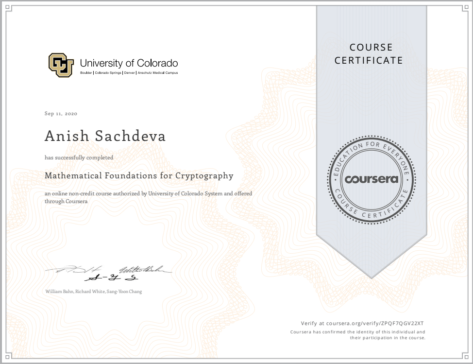

# Mathematical Foundations for Cryptography @Coursera
__~University of Colorado__

## Index
- [Week 1](#week-1-integer-foundations)
- [Week 2](#week-2-modular-exponentiation)
- [Week 3](#week-3-chinese-remainder-theorem)
- [Week 4](#week-4-primality-testing)
- [Certificate](#-certificate)

## Week 1: Integer Foundations
- [Practice Assessment: Integer Foundation](week1/practice-assesment-integer-foundation.md)
- [Graded Assessment: Integer Foundation](week1/graded-asessment-integer-foundation.md)

## Week 2: Modular Exponentiation
- [Practice Assessment: Modular Exponentiation](week2/practice-assesment-modular-exponentiation.md)
- [Graded Assessment: Modular Exponentiation](week2/graded-assessment-modular-exponentiation.md)

## Week 3: Chinese Remainder Theorem
- [Practice Assessment: Chinese Remainder Theorem](week3/practice-assessment-chinese-remainder-theorem.md)
- [Graded Assessment: Chinese Remainder Theorem](week3/graded-assessment-chinese-remainder-theorem.md)

## Week 4: Primality Testing
- [Practice Assessment: Primality Testing](week4/practice-assessment-primality-teseting.md)
- [Graded Assessment: Primality Testing](week4/graded-assessment-primality-teseting.md)
- [Quiz: Course Project](week4/quiz-course-project.md)

## [🎓 Certificate](http://coursera.org/verify/ZPQF7QGV22XT)

